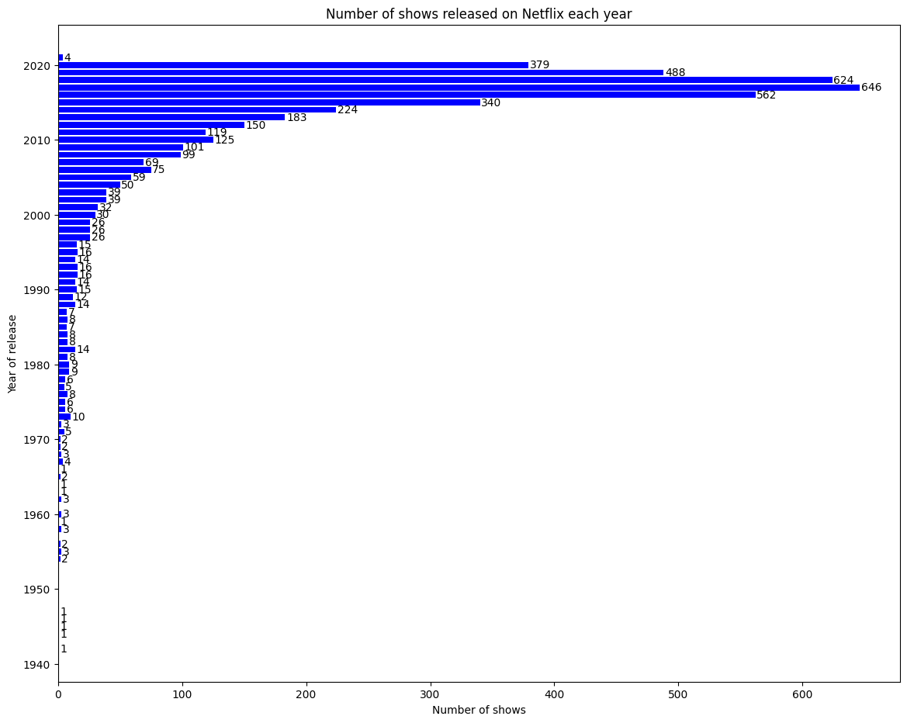
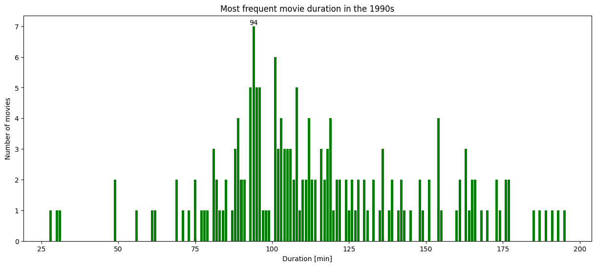
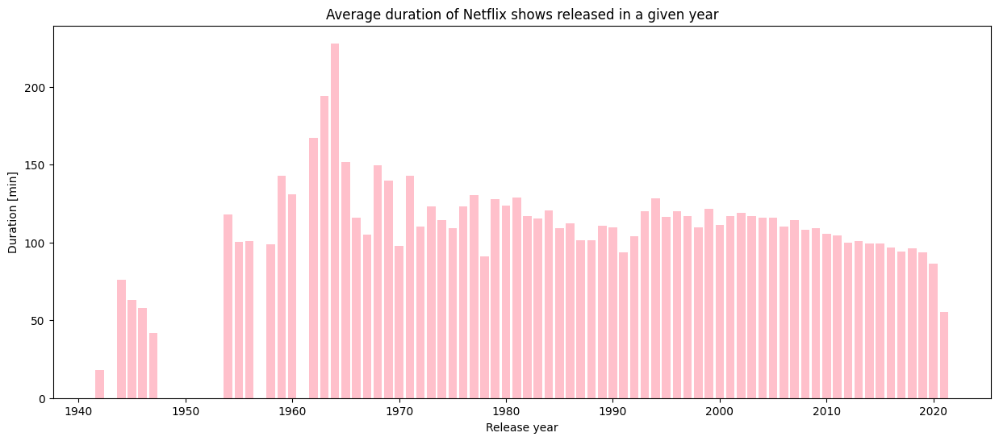
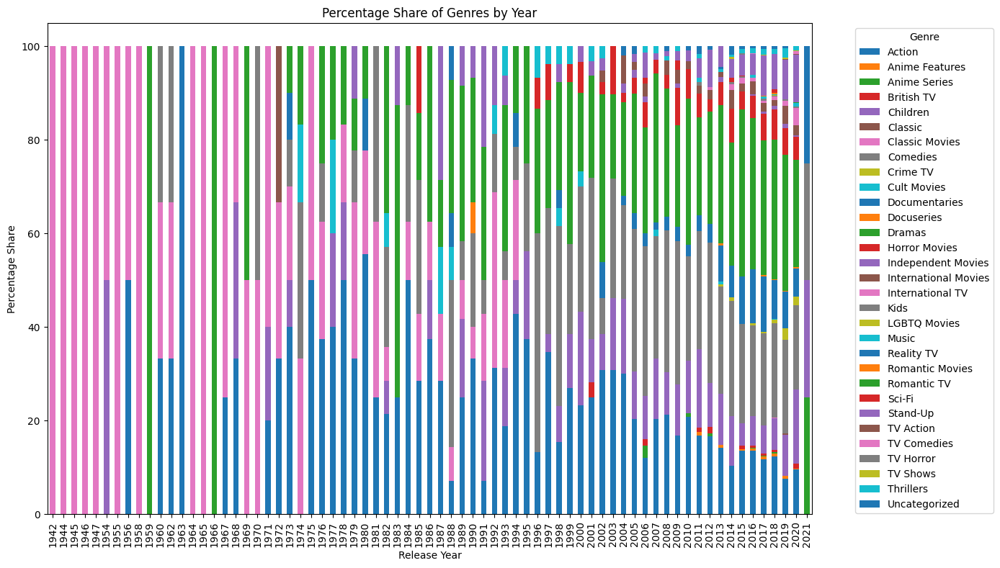
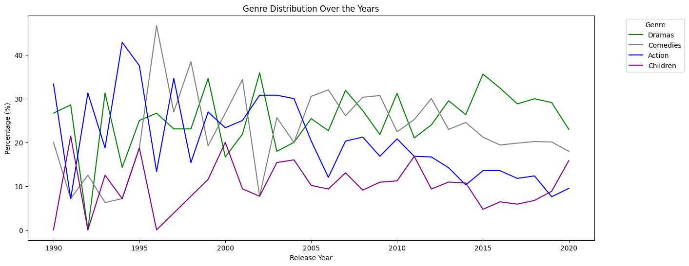
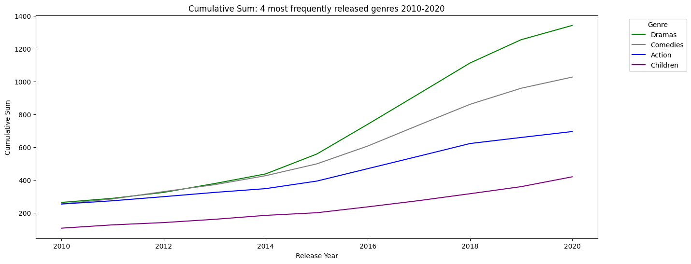
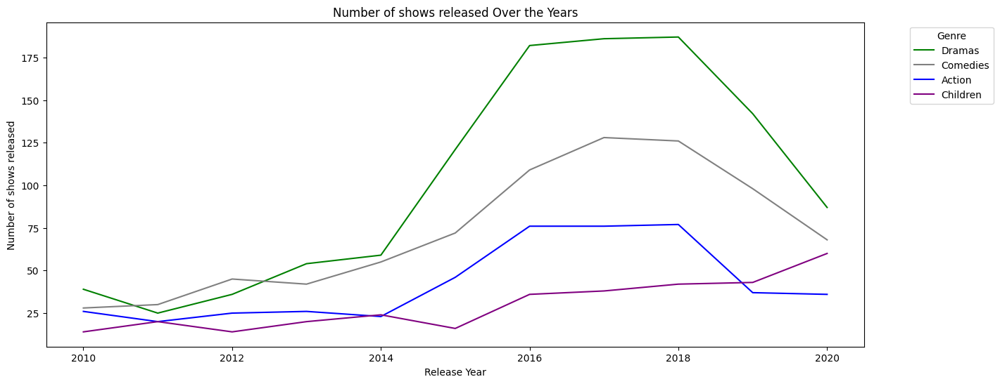

Netflix started in 1997 as a DVD rental service and has since exploded into one of the largest entertainment and media companies.
Given the large number of movies and series available on the platform, it is a perfect opportunity to run some exploratory data analysis and draw some interesting conclusions about the entertainment industry.
This presentation utilizes **python** with its **matplotlib** and **pandas** libraries

**Note**: the data available for this presentation was collected in early 2021. It is given as a simple .csv file.

```python
# Importing pandas and matplotlib
import pandas as pd
import matplotlib.pyplot as plt

# Read in the Netflix CSV as a DataFrame
netflix_df = pd.read_csv("netflix_data.csv")
```

So how to start an exploratory data analysis, assuming you don't know anything about the data? Firstly, I'd like to know more about what kind od data I have.

```python
# Check the shape of the dataframe. The result is (number fo rows, number of columns)
netflix_df.shape
```

    (4812, 11)

```python
# Print the first 10 rows of the dataframe to see names of the headers and what kind of data is stored in each column
netflix_df.head(10)
```

```python
netflix_df.columns
```

    Index(['show_id', 'type', 'title', 'director', 'cast', 'country', 'date_added',
           'release_year', 'duration', 'description', 'genre'],
          dtype='object')

```python
netflix_df.index
```

    RangeIndex(start=0, stop=4812, step=1)

Check if there are any missing values in the dataframe

```python
print(netflix_df.isna().sum())
```

    show_id         0
    type            0
    title           0
    director        0
    cast            0
    country         0
    date_added      0
    release_year    0
    duration        0
    description     0
    genre           0
    dtype: int64

After this preliminary check it is knonwn that the database has 4812 rows (so 4812 shows) and each row has 11 colums of data:

| Column         | Description                     |
| -------------- | ------------------------------- |
| `show_id`      | Unique ID of the show           |
| `type`         | Type of show                    |
| `title`        | Title of the show               |
| `director`     | Director of the show            |
| `cast`         | Cast of the show                |
| `country`      | Country of origin               |
| `date_added`   | Date added to Netflix           |
| `release_year` | Year of Netflix release         |
| `duration`     | Duration of the show in minutes |
| `description`  | Description of the show         |
| `genre`        | Show genre                      |

Let me start with some simple Simple quantitative analyses.

```python
# Check how many shows are there in the database by type of show
types_sum = netflix_df.groupby('type').count()
print(types_sum['show_id'])
```

    type
    Movie      4677
    TV Show     135
    Name: show_id, dtype: int64

```python
# Create a pie chart out of these data
type_counts = types_sum['show_id']
plt.figure(figsize=(8, 8))
plt.pie(type_counts, labels=type_counts.index, autopct='%1.1f%%', startangle=100)

plt.title('Distribution of Netflix shows by Type')
plt.show()
```


```python
# Check how many shows are there in the database by genre
genres_sum = netflix_df.groupby('genre').size().reset_index(name='count')
# Sort the results with most frequent on top
genres_sum_sorted = genres_sum.sort_values(by='count', ascending=False)

print(genres_sum_sorted.to_string(index=False))
# Count the number of genres
number_of_genres = len(genres_sum)
print('Total number of genres: ' + str(number_of_genres))
```

                   genre  count
                  Dramas   1343
                Comedies   1029
                  Action    696
                Children    421
           Documentaries    352
                Stand-Up    283
           Horror Movies    239
    International Movies    100
          Classic Movies     69
               Thrillers     49
        International TV     39
                Crime TV     30
           Uncategorized     25
              British TV     20
      Independent Movies     20
          Anime Features     18
                   Music     14
             Cult Movies     11
                  Sci-Fi     11
                    Kids     10
            Anime Series      9
              Docuseries      7
                TV Shows      4
         Romantic Movies      3
             TV Comedies      3
               TV Action      2
            LGBTQ Movies      1
              Reality TV      1
                 Classic      1
               TV Horror      1
             Romantic TV      1
    Total number of genres: 31

```python
#check how many shows are there in the database by country of origin. Display in alphabetical order
coutries_sum = netflix_df.groupby('country').count()
print(coutries_sum['show_id'])
```

    country
    Argentina          46
    Australia          50
    Austria             5
    Bangladesh          2
    Belgium             6
                     ...
    United States    1886
    Uruguay             7
    Venezuela           1
    Vietnam             5
    Zimbabwe            1
    Name: show_id, Length: 72, dtype: int64

```python
#check how many shows are there in the database by year of release
years_sum = netflix_df.groupby('release_year').count()

# Build a bar plot for the data.
plt.figure(figsize=(14, 11))
graph = plt.barh(years_sum.index, years_sum['show_id'], color='blue')

# Add value-as-text next to each bar
for bar in graph:
    xval = bar.get_width()
    plt.text(xval + 1, bar.get_y() + bar.get_height()/2, int(xval), ha='left', va='center')

# Strings
xlab = 'Number of shows'
ylab = 'Year of release'
title = 'Number of shows released on Netflix each year'

# Add axis labels
plt.xlabel(xlab)
plt.ylabel(ylab)
# Add title
plt.title(title)

# display the plot after customizing
plt.show()
```



# So now I can say that I know my data quite well. It is time to aks some more interesting questions and get the answers by analyzing the data.

First example. What was the mean duration of all movies released between 1990 and 1999?

```python
# Extract Movies only (drop TV shows)
movies_only = netflix_df[netflix_df['type'] == 'Movie']

# Further subset the data: select movies from the nineties
movies_1990s = movies_only[(movies_only['release_year'] >= 1990) & (movies_only['release_year'] <= 1999)]

# calculate the mean duration of the above subset
duration1 = round(movies_1990s['duration'].mean())
print('The mean duration of all movies released between 1990 and 1999 is ' + str(duration1) + ' min')

```

    The mean duration of all movies released between 1990 and 1999 is 115 min

Let's put it in a slightly different way. What was the most frequent movie duration in the 1990s?

```python
#Group movies form 1990s by duration and count occurrences
movies_1990s_duration = movies_1990s.groupby('duration').count()

# Get the index name (so the duration) of the row with the most counts. (all the colums are the same, so take one of them)
# Convert the result to regular integer
duration = int(movies_1990s_duration['show_id'].idxmax())
print('The most frequent movie duration released between 1990 and 1999 is ' + str(duration) + ' min')
```

    The most frequent movie duration released between 1990 and 1999 is 94 min

Let me build a graphic representation for this.

```python
# Build a bar plot for the data.
plt.figure(figsize=(15, 6))
graph = plt.bar(movies_1990s_duration.index, movies_1990s_duration['show_id'], color='green')

# Add value-as-text above a bar which represents max value
maxval = 0
for bar in graph:
    yval = bar.get_height()
    if yval > maxval:
        xval = bar.get_x() + bar.get_width()/2
        maxval = yval
plt.text(xval, maxval, int(xval), ha='center', va='bottom')

# Strings
xlab = 'Duration [min]'
ylab = 'Number of movies'
title = 'Most frequent movie duration in the 1990s'

# Add axis labels
plt.xlabel(xlab)
plt.ylabel(ylab)
# Add title
plt.title(title)

# display the plot after customizing
plt.show()
```



Next interesting question: Have shows become shorter of longer in recent years?

```python
# Calculate the mean duration of the shows released in a given year.
mean_duration_by_year = netflix_df.groupby('release_year')['duration'].mean()

# Build a bar plot for the data.
plt.figure(figsize=(15, 6))
graph = plt.bar(mean_duration_by_year.index, mean_duration_by_year, color='pink')

# Add axis labels
plt.xlabel('Release year')
plt.ylabel('Duration [min]')
# Add title
plt.title('Average duration of Netflix shows released in a given year')
```

    Text(0.5, 1.0, 'Average duration of Netflix shows released in a given year')



The answer? I think I can see a general trend: starting from 2001, shows have become a bit shorter each year.

Another example.
Let's assume that someone asked to count the number of short action movies released in the 1990s. (and let's assume that a movie is considered short if it is less than 90 minutes)

```python
# Extract Action Movies only (drop TV shows)
action_movies = netflix_df[(netflix_df['type'] == 'Movie') & (netflix_df['genre'] == 'Action')]

# Further subset data: select movies from the nineties
action_movies_1990s = action_movies[(action_movies['release_year'] >= 1990) & (action_movies['release_year'] <= 1999)]

# Declare the counter for the task
short_movie_count = 0
#count the movies which are shorter than 90min
for index, row in action_movies_1990s.iterrows():
    if row['duration'] < 90:
        short_movie_count += 1

print('Asnwer: In the given database there are ' + str(short_movie_count) + ' action movies made in the 1990s which are shorter than 90 minutes.')
```

    Asnwer: In the given database there are 7 action movies made in the 1990s which are shorter than 90 minutes.

On with another task. I would like to know the percentage share of each genre in the total amount of shows released each year. In other words: Were there more comedies than dramas released in 2020? Was it the same 20 years ago?

```python
# Group data by release year and genre, count the number of occurrences
genre_counts_by_year = netflix_df.groupby(['release_year', 'genre']).size().reset_index(name='count')

# Group by release year and calculate the total number of occurrences in each year
total_counts_by_year = netflix_df.groupby('release_year').size().reset_index(name='total_count')

# Merge both tables to get the total number of occurrences in each year
merged_df = pd.merge(genre_counts_by_year, total_counts_by_year, on='release_year')

# Calculate the percentage share of each genre in a given year
merged_df['percentage'] = (merged_df['count'] / merged_df['total_count']) * 100

# Pivot the data to a wide format for the bar chart
pivot_df = merged_df.pivot(index='release_year', columns='genre', values='percentage')

# Fill missing values with zeros
pivot_df = pivot_df.fillna(0)

# Create the bar chart
pivot_df.plot(kind='bar', stacked=True, figsize=(14, 8))

# Add title and axis labels
plt.title('Percentage Share of Genres by Year')
plt.xlabel('Release Year')
plt.ylabel('Percentage Share')

# Add legend
plt.legend(title='Genre', bbox_to_anchor=(1.05, 1), loc='upper left')

# Display the chart
plt.tight_layout()
plt.show()
```



Well, that is a very nice graph :-) But You can't answer the above question by looking at it. It is almost completely unreadable and not very useful. It can be seen that the classic movies dominated until 1970, but not much more really.
So let's try to modify it. I'll take 4 most frequently released genres and cut the time range to 1990-2020.

```python
# Based on previos querries, we already know that 4 most frequently released genres are: Dramas, Comedies, Action and Children
popular_genres_percentage = pivot_df[['Dramas', 'Comedies', 'Action', 'Children']]

# And we are interested in analyzing the last 30 years only
recent_popular_genres_percentage = popular_genres_percentage[(popular_genres_percentage.index >= 1990) & (popular_genres_percentage.index <= 2020)]

# Let's build a graph out of that data frame
plt.figure(figsize=(15, 6))
plt.plot(recent_popular_genres_percentage.index, recent_popular_genres_percentage['Dramas'], label='Dramas', color='green')
plt.plot(recent_popular_genres_percentage.index, recent_popular_genres_percentage['Comedies'], label='Comedies', color='grey')
plt.plot(recent_popular_genres_percentage.index, recent_popular_genres_percentage['Action'], label='Action', color='blue')
plt.plot(recent_popular_genres_percentage.index, recent_popular_genres_percentage['Children'], label='Children', color='purple')

# Add Labels and title
plt.xlabel('Release Year')
plt.ylabel('Percentage (%)')
plt.title('Genre Distribution Over the Years')
# Add legend
plt.legend(title='Genre', bbox_to_anchor=(1.05, 1), loc='upper left')

plt.show()
```



That's better, but still not great. The graph is barely readable. It can be seen that action movies have become less popular recenly. Or maybe there are just more shows of different genres being released? All in all it is not the best approach.

Let's try to analyze cumulative sums instead.

```python
# I already have genre_counts_by_year calculated before
# Pivot the data to a wide format for the chart. Fill missing values with zeros
pivot_2 = genre_counts_by_year.pivot(index='release_year', columns='genre', values='count').fillna(0)
# Calculate cumulative sum of each genre
cum_genre_counts_by_year = pivot_2.cumsum()

# Take that 4 most frequently released genres
cum_popular_genres = cum_genre_counts_by_year[['Dramas', 'Comedies', 'Action', 'Children']]

# Take the last 30 years only
recent_cum_popular_genres = cum_popular_genres[(cum_popular_genres.index >= 2010) & (cum_popular_genres.index <= 2020)]

# A graph out of that data frame
plt.figure(figsize=(15, 6))
plt.plot(recent_cum_popular_genres.index, recent_cum_popular_genres['Dramas'], label='Dramas', color='green')
plt.plot(recent_cum_popular_genres.index, recent_cum_popular_genres['Comedies'], label='Comedies', color='grey')
plt.plot(recent_cum_popular_genres.index, recent_cum_popular_genres['Action'], label='Action', color='blue')
plt.plot(recent_cum_popular_genres.index, recent_cum_popular_genres['Children'], label='Children', color='purple')

# Add Labels and title
plt.xlabel('Release Year')
plt.ylabel('Cumulative Sum')
plt.title('Cumulative Sum: 4 most frequently released genres 2010-2020')
# Add legend
plt.legend(title='Genre', bbox_to_anchor=(1.05, 1), loc='upper left')

plt.show()
```



Now that is a graph which makes sense! It's clean, readable and you can draw conclusions from it:

1. In 2010 there were almost exactly as many dramas as comedies and action movies.
2. Ten years later there was more than 1300 dramas, compared with about 1000 comedies and only about 700 action movies. Which shows that dramas are becoming more and more popular each year.
3. the number of children's shows released in 2018-2020 maintained an increasing trend, while in the case of other programs there was a decreasing trend

Let's pair this with another plot: Number of 4 most popular genres released every year:

```python
# Take that 4 most frequently released genres
popular_genres = pivot_2[['Dramas', 'Comedies', 'Action', 'Children']]

# Take the last 30 years only
recent_popular_genres = popular_genres[(popular_genres.index >= 2010) & (popular_genres.index <= 2020)]

# A graph out of that data frame
plt.figure(figsize=(15, 6))
plt.plot(recent_popular_genres.index, recent_popular_genres['Dramas'], label='Dramas', color='green')
plt.plot(recent_popular_genres.index, recent_popular_genres['Comedies'], label='Comedies', color='grey')
plt.plot(recent_popular_genres.index, recent_popular_genres['Action'], label='Action', color='blue')
plt.plot(recent_popular_genres.index, recent_popular_genres['Children'], label='Children', color='purple')

# Add Labels and title
plt.xlabel('Release Year')
plt.ylabel('Number of shows released')
plt.title('Number of shows released Over the Years')
# Add legend
plt.legend(title='Genre', bbox_to_anchor=(1.05, 1), loc='upper left')

plt.show()
```



As seen above, some very interesting conclusions can be drawn from analysis of relatively simple data. What is more, some trends and predictions regarding the number of programs to be released in the future years can be calculated.

The above examples also demonstrate the versatility and ease of use of python with the pandas and matplotlib extensions for data analysis, manipulation and presentation purposes.
